<h1 align="center">🏠 Helperly – Domestic Services Booking App</h1>

A full-stack mobile application that connects users with trusted domestic service providers. 
Built with a focus on real-world UX, smooth booking flow, and modern mobile design.

🚀 <b>Production-ready Android APK available</b> 
<a href="https://expo.dev/accounts/rajassg/projects/mobile-app/builds/283e4b80-71e7-447b-b9ce-3d30a8434c1b">
👉 Download Latest APK
</a>

---

## ✨ Key Highlights

- 🔁 Complete booking lifecycle (User ↔ Worker)
- 🔐 Secure authentication with JWT
- ⚡ Real-time UX with status updates & feedback
- 🎯 Clean UI with modern mobile design principles
- ☁️ Fully deployed backend & database (Render)
- 📱 APK build using Expo EAS

---

## 🚀 Features

### 👤 User
- Browse available services
- Book services instantly
- View booking status (Pending / Accepted / Rejected)
- Prevent duplicate bookings
- View worker details after acceptance

---

### 👷 Worker
- Add, edit, and delete services
- View incoming booking requests
- Accept or reject bookings
- View user details after accepting

---

### 🔐 Authentication
- Secure login & registration
- Role-based access (User / Worker)
- Persistent sessions using AsyncStorage
- JWT-based authentication

---

## 🌐 Live Backend

🔗 https://domestic-helper-booking-app.onrender.com  

> ⚠️ Note: Backend may take 10–20 seconds to wake up (Render free tier)

---

## 📸 App Screenshots

### 🏠 Home & Explore

  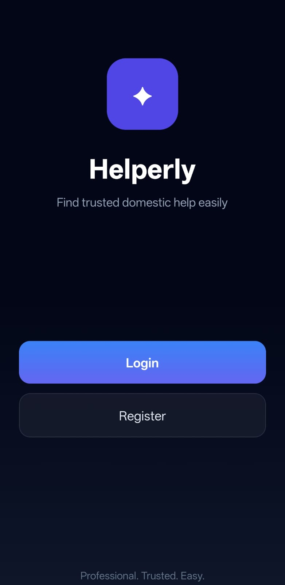
  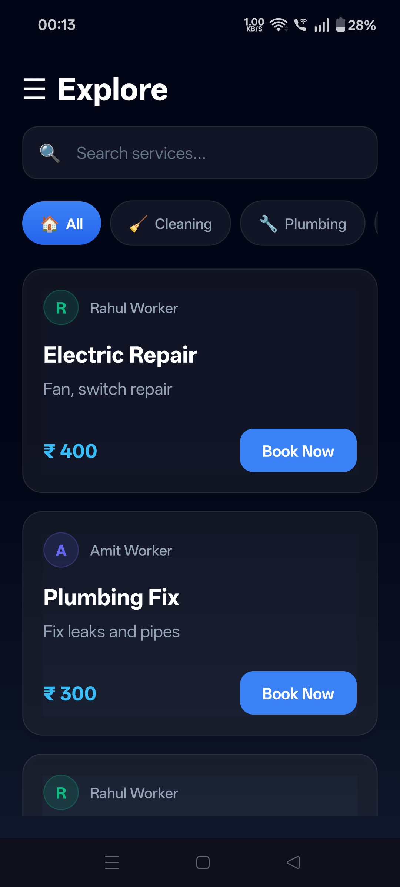
  

---

### 🔐 Authentication

  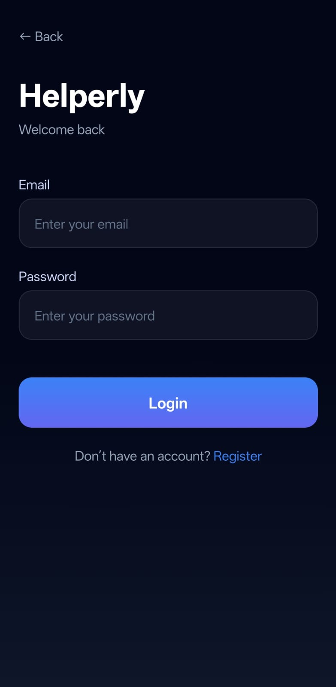
  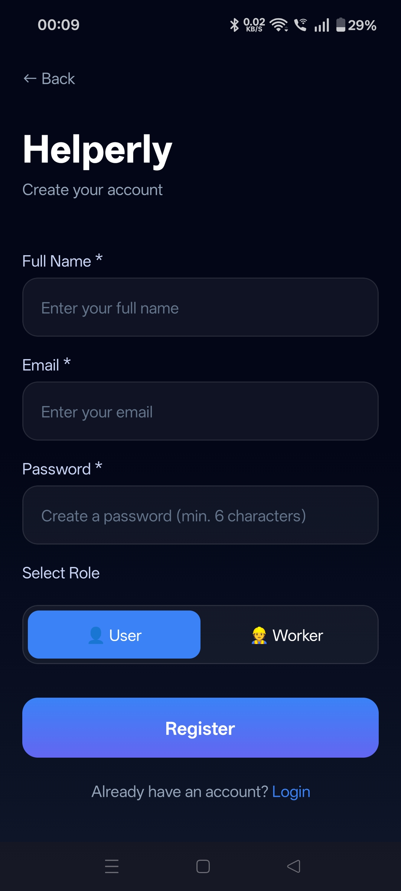

---

### 📦 Booking System

  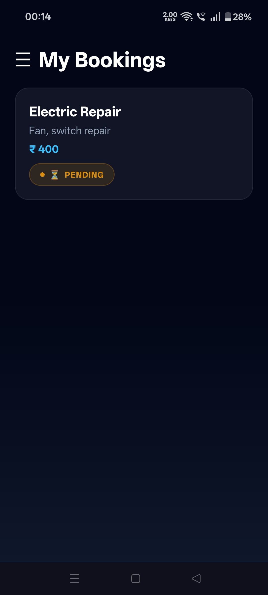
  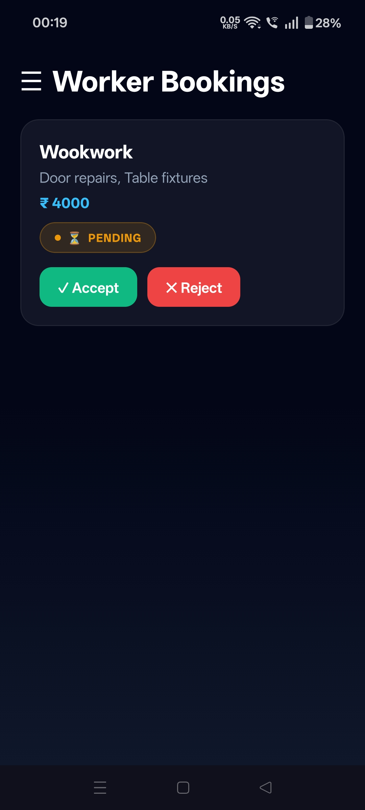
  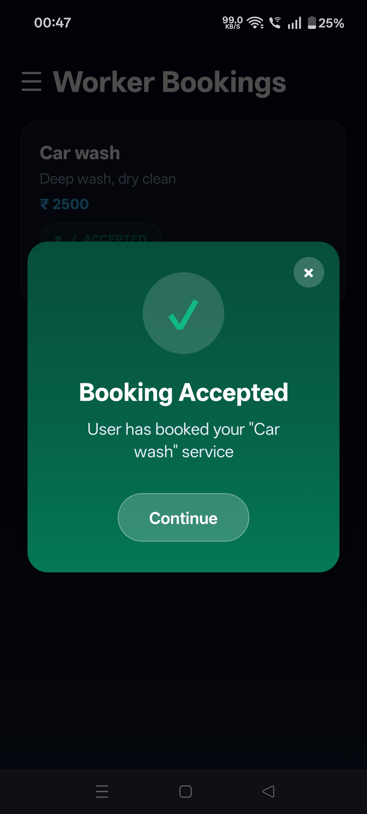

---

### 👷 Worker Dashboard

  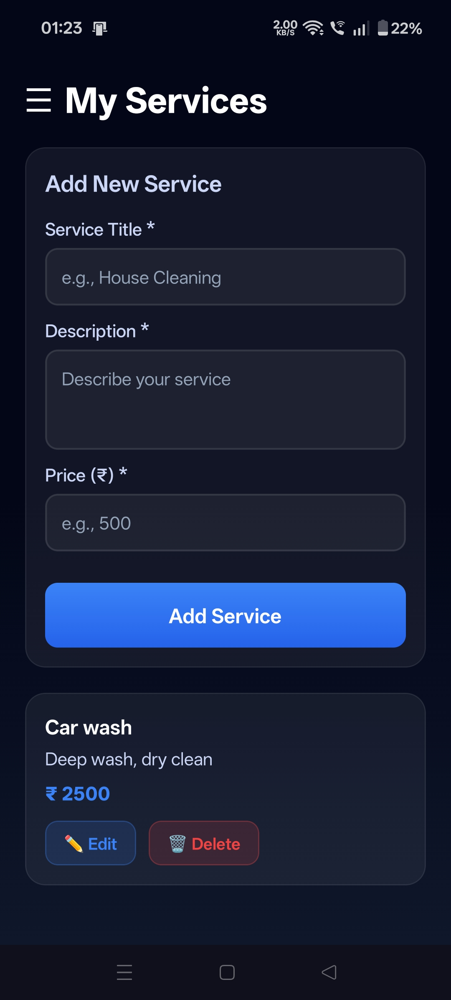
  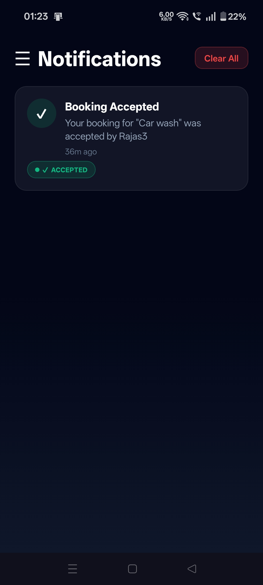

---

### ⚙️ Profile & Navigation

  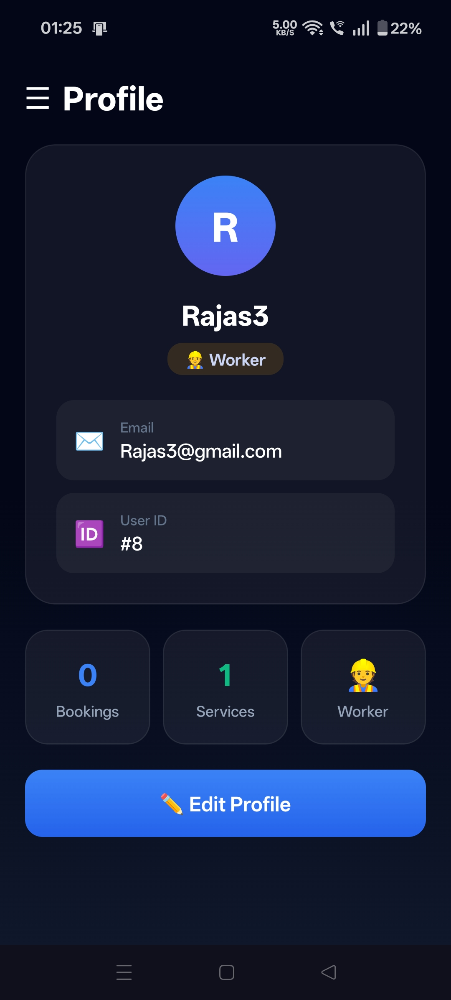
  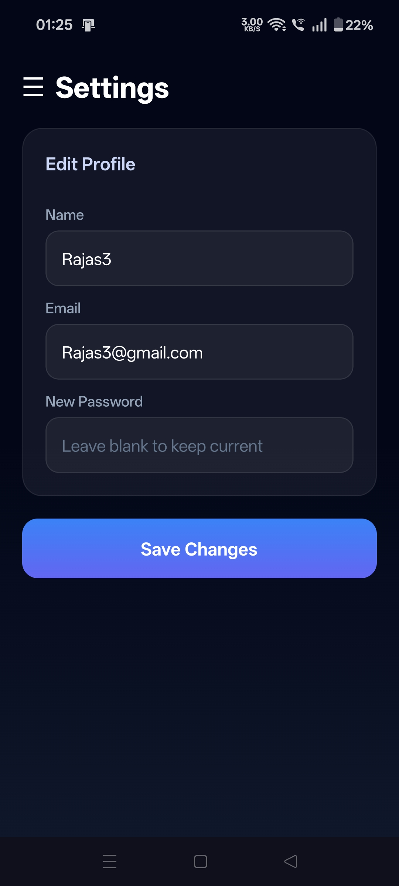
  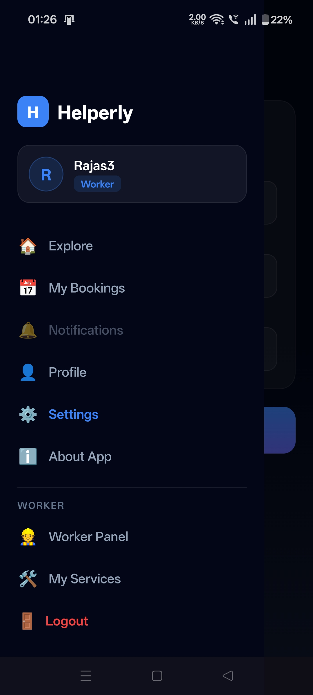

---

## 🔄 Booking Flow

1. Worker creates a service  
2. User browses and books  
3. Booking created → **Pending**  
4. Worker accepts/rejects  
5. User sees updated status  
6. Both can view each other's details after acceptance  

---

## 🧠 Tech Stack

### 📱 Frontend
- React Native (Expo)
- Expo Router
- TypeScript
- Axios
- AsyncStorage
- Expo Linear Gradient

---

### 🖥 Backend
- Node.js
- Express.js
- PostgreSQL (Render Hosted)
- JWT Authentication

---

### ☁️ Deployment
- Backend → Render
- Database → Render PostgreSQL
- Mobile App → Expo EAS (APK)

---

## 🧩 Project Structure

<pre>
mobile-app/
├── app/
│ ├── (drawer)/
│ ├── home.tsx
│ ├── bookings.tsx
│ ├── worker.tsx
│ ├── my-services.tsx
│ ├── settings.tsx
│ └── profile.tsx
│
├── assets/
├── app.json
└── .env

backend/
├── controllers/
├── routes/
├── models/
├── config/
├── .env
└── server.js
</pre>

<h2>⚙️ Setup Instructions</h2>

<h3>1️⃣ Clone Repository</h3>
<pre>
git clone https://github.com/your-username/helperly-app.git
cd helperly-app
</pre>

<h3>2️⃣ Backend Setup</h3>
<pre>
cd backend
npm install
</pre>

Create <b>.env</b> file:

<pre>
PORT=5000
DATABASE_URL=your_postgres_url
JWT_SECRET=your_secret
</pre>

<pre>
npm run dev
</pre>

<h3>3️⃣ Frontend Setup</h3>
<pre>
cd mobile-app
npm install
</pre>

Create <b>.env</b> file:

<pre>
EXPO_PUBLIC_API_URL=https://domestic-helper-booking-app.onrender.com
</pre>

<pre>
npx expo start
</pre>

<h2>📱 APK Build</h2>

<pre>
eas build -p android --profile preview
</pre>

<h2>🌐 API Endpoints</h2>

<ul>
  <li><b>POST</b> /api/auth/register</li>
  <li><b>POST</b> /api/auth/login</li>
  <li><b>GET</b> /api/services</li>
  <li><b>POST</b> /api/services</li>
  <li><b>POST</b> /api/bookings/book</li>
  <li><b>GET</b> /api/bookings/user/:id</li>
  <li><b>GET</b> /api/bookings/worker/:id</li>
  <li><b>PUT</b> /api/bookings/:id</li>
</ul>

<h2>✨ Key Highlights</h2>

<ul>
  <li>Full end-to-end booking workflow</li>
  <li>Role-based system (User / Worker)</li>
  <li>Real-world UX (duplicate booking prevention)</li>
  <li>Cloud-deployed backend & database</li>
  <li>Production-ready mobile APK</li>
  <li>Modern UI with status badges</li>
</ul>

<h2>📈 Future Improvements</h2>

<ul>
  <li>Payment integration</li>
  <li>Push notifications</li>
  <li>Ratings & reviews</li>
  <li>In-app chat</li>
  <li>Service image uploads</li>
</ul>

<h2>👨‍💻 Author</h2>

<b>Rajas Ghongade</b> 
Aspiring Full-Stack Developer | React Native Enthusiast 
Focused on building scalable, user-centric applications with clean UI and real-world functionality.

<h2>⭐ Support</h2>

If you like this project, consider giving it a ⭐ on GitHub!

