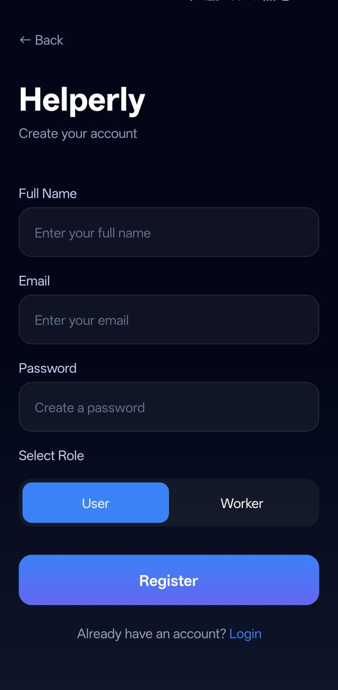
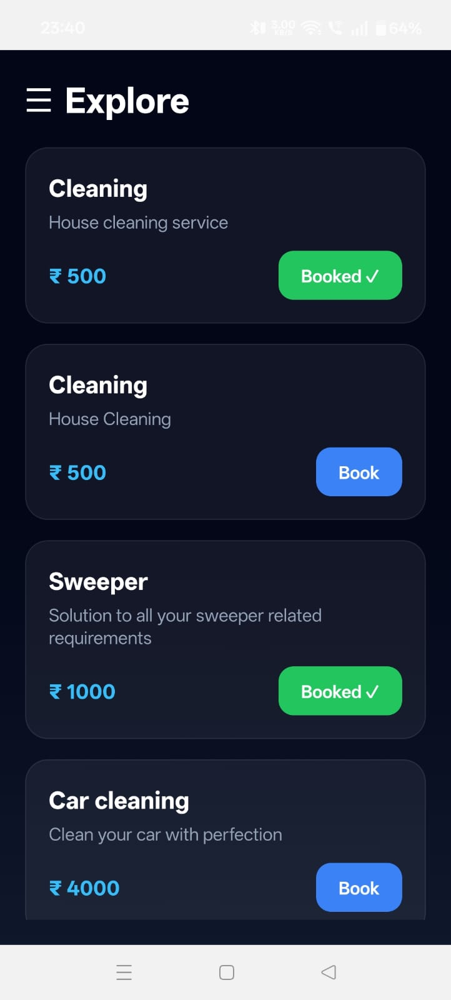
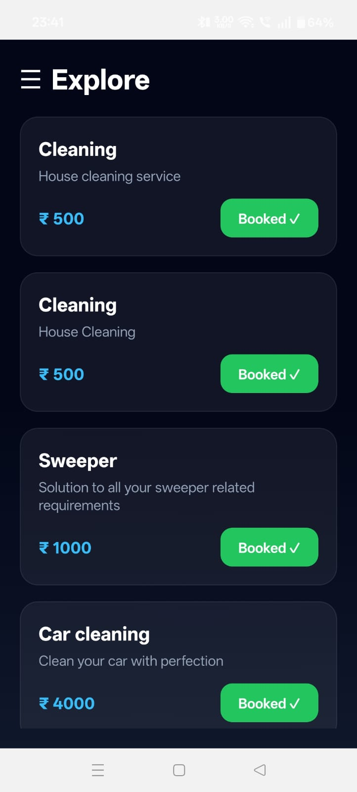
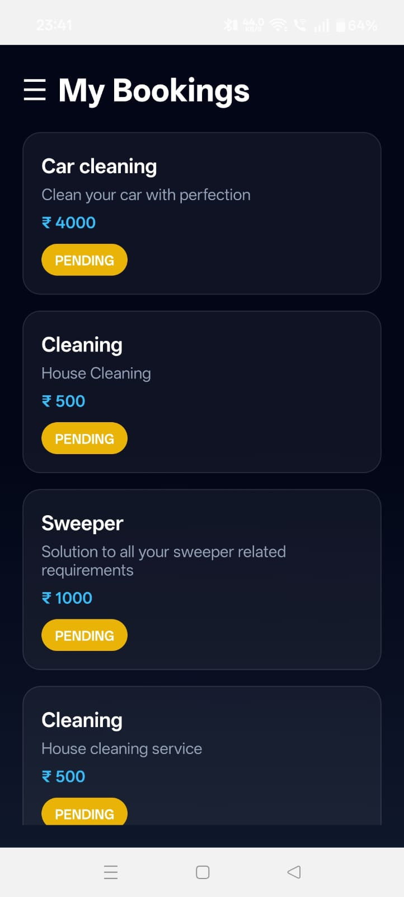
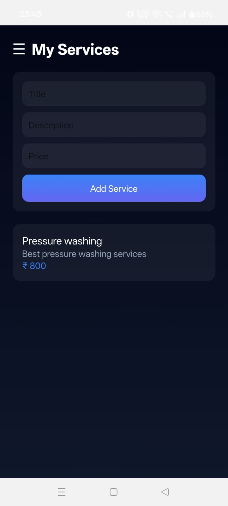
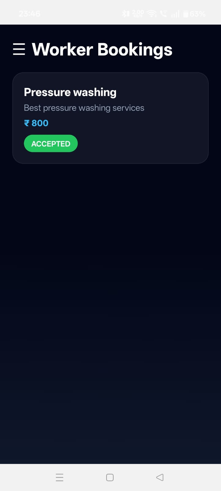
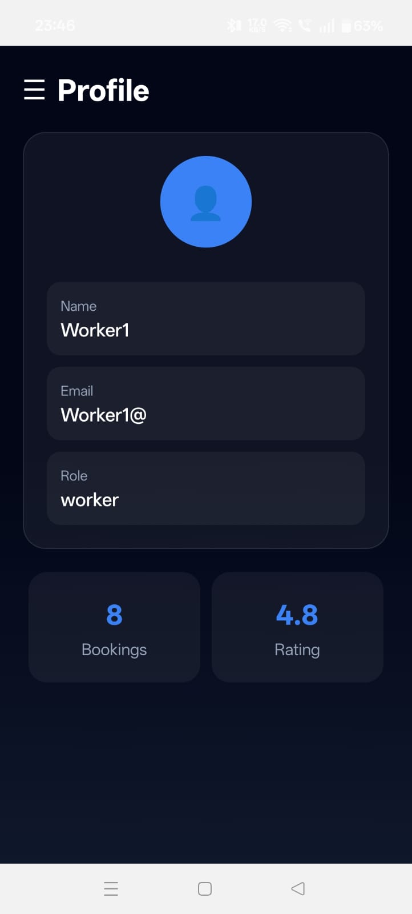
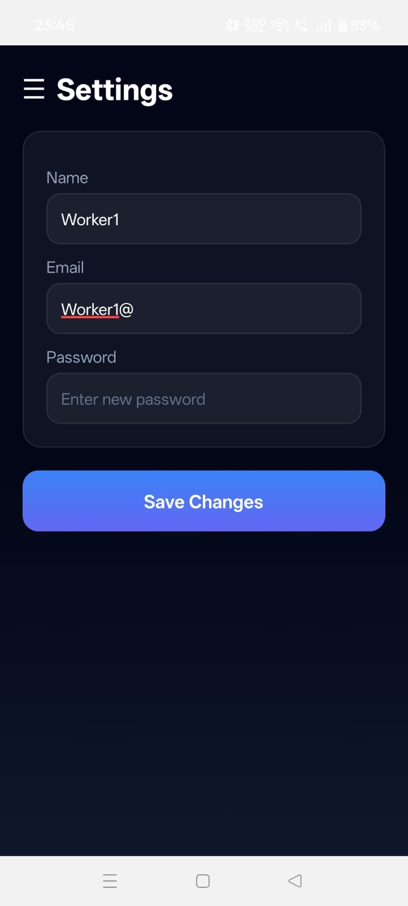
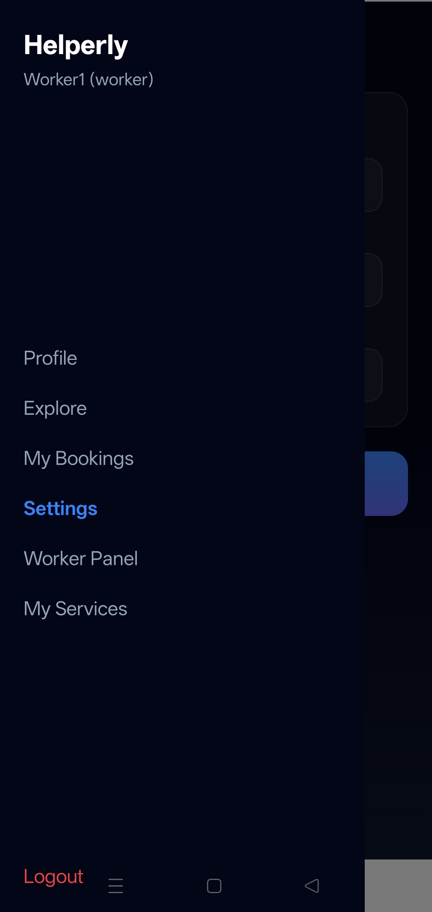

<h1 align="center">🏠 Helperly – Domestic Services Booking App</h1>

A full-stack mobile application connecting users with domestic service providers, featuring real-time booking flow, role-based access, and a polished modern UI.

<h2>🚀 Features</h2>

<h3>👤 User Features</h3>
<ul>
  <li>Browse available services</li>
  <li>Book services instantly</li>
  <li>View booking status (Pending / Accepted / Rejected)</li>
  <li>Prevent duplicate bookings</li>
  <li>Clean and intuitive UI</li>
</ul>

<h3>👷 Worker Features</h3>
<ul>
  <li>Add and manage services</li>
  <li>View booking requests</li>
  <li>Accept or reject bookings</li>
  <li>Dedicated worker dashboard</li>
</ul>

<h3>🔐 Authentication</h3>
<ul>
  <li>Secure login & registration</li>
  <li>Role-based access (User / Worker)</li>
  <li>Persistent login using AsyncStorage</li>
  <li>JWT-based authentication</li>
</ul>

<h2>🧠 Tech Stack</h2>

<h3>📱 Frontend</h3>
<ul>
  <li>React Native (Expo)</li>
  <li>Expo Router</li>
  <li>Axios</li>
  <li>AsyncStorage</li>
  <li>Expo Linear Gradient</li>
</ul>

<h3>🖥 Backend</h3>
<ul>
  <li>Node.js</li>
  <li>Express.js</li>
  <li>PostgreSQL</li>
  <li>JWT Authentication</li>
</ul>

<h2>📸 App Screenshots</h2>

<h3> Home page</h3>

<h3>🔐 Authentication</h3>

<h3>🏠 Explore Services</h3>

<h3>📦 Booking System</h3>

<h3>👷 Worker Panel</h3>

<h3>⚙️ Profile & Settings</h3>

<h2>🔄 Booking Flow</h2>

<ol>
  <li>User browses services</li>
  <li>User clicks <b>Book</b></li>
  <li>Booking created with <b>Pending</b> status</li>
  <li>Worker receives request</li>
  <li>Worker accepts or rejects</li>
  <li>User sees updated status</li>
</ol>

<h2>🧩 Project Structure</h2>

<pre>
mobile-app/
 ├── app/
 │    ├── (drawer)/
 │    ├── home.tsx
 │    ├── bookings.tsx
 │    ├── worker.tsx
 │    ├── settings.tsx
 │    └── profile.tsx

backend/
 ├── controllers/
 ├── routes/
 ├── models/
 ├── config/
 └── server.js
</pre>

<h2>⚙️ Setup Instructions</h2>

<h3>1️⃣ Clone Repository</h3>
<pre>git clone https://github.com/your-username/helperly-app.git
cd helperly-app</pre>

<h3>2️⃣ Backend Setup</h3>
<pre>cd backend
npm install</pre>

Create <b>.env</b> file:

<pre>
PORT=5000
DATABASE_URL=your_postgres_url
JWT_SECRET=your_secret
</pre>

<pre>npm run dev</pre>

<h3>3️⃣ Frontend Setup</h3>
<pre>cd frontend
npm install
npm start</pre>

<h2>🌐 API Endpoints</h2>

<ul>
  <li><b>POST</b> /api/auth/register</li>
  <li><b>POST</b> /api/auth/login</li>
  <li><b>GET</b> /api/services</li>
  <li><b>POST</b> /api/services</li>
  <li><b>POST</b> /api/bookings/book</li>
  <li><b>GET</b> /api/bookings/user/:id</li>
  <li><b>GET</b> /api/bookings/worker/:id</li>
  <li><b>PUT</b> /api/bookings/:id</li>
</ul>

<h2>✨ Key Highlights</h2>

<ul>
  <li>Full end-to-end booking workflow</li>
  <li>Role-based system (User / Worker)</li>
  <li>Real-world UX (duplicate booking prevention)</li>
  <li>Modern UI with status badges</li>
  <li>Scalable backend architecture</li>
</ul>

<h2>📈 Future Improvements</h2>

<ul>
  <li>Payment integration</li>
  <li>Push notifications</li>
  <li>Ratings & reviews</li>
  <li>In-app chat</li>
  <li>Service image uploads</li>
</ul>

<h2>👨‍💻 Author</h2>

<b>Rajas Ghongade</b> 
Aspiring Full-Stack Developer | React Native Enthusiast 
Focused on building scalable, user-centric applications with clean UI and real-world functionality.

<h2>⭐ Support</h2>

If you like this project, consider giving it a ⭐ on GitHub!

